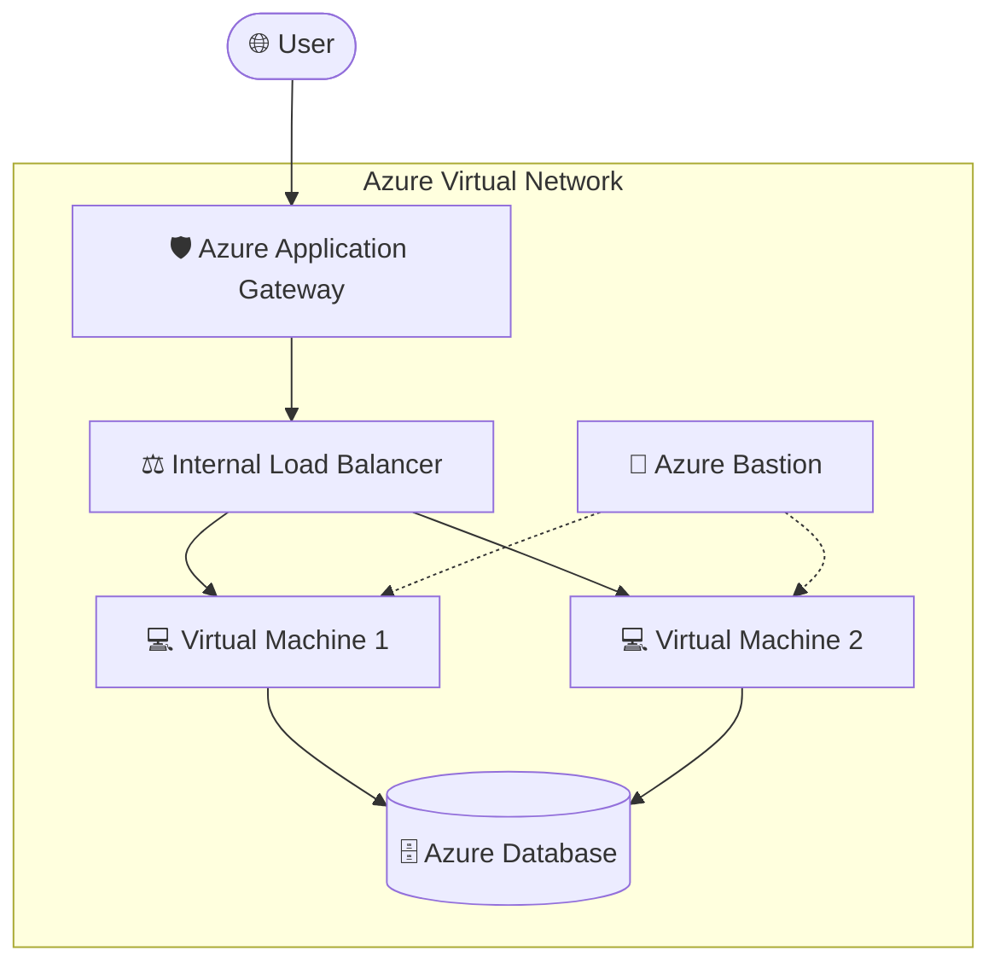

# 🚀 Monolithic ToDo App Infrastructure

This repository contains the Terraform-based infrastructure code for a Monolithic ToDo Application hosted on Azure. It follows a modular design to ensure scalability, reusability, and maintainability across different environments (Dev, QA, Prod).

---

## 🏗️ Architecture Diagram

The following diagram illustrates the infrastructure flow and component relationships:



---

## 📂 Folder Structure

```text
📂 MonolithicToDoApp
├── 📂 Environment          # Environment-specific configurations
│   ├── 📂 dev              # Development environment
│   ├── 📂 qa               # QA environment
│   └── 📂 prod             # Production environment
├── 📂 Module               # Reusable Terraform Modules
│   ├── 📂 azurerm_application_gateway
│   ├── 📂 azurerm_bastion
│   ├── 📂 azurerm_database
│   ├── 📂 azurerm_internal_loadbalancer
│   ├── 📂 azurerm_niclb_association
│   ├── 📂 azurerm_publicip
│   ├── 📂 azurerm_resource_group
│   ├── 📂 azurerm_virtual_machine
│   └── 📂 azurerm_virtual_network
├── 📂 Pipeline             # CI/CD Pipeline definitions (Placeholder)
├── 📂 Test                 # Infrastructure testing using Terratest
│   ├── 📄 terra_test.go    # Go test file
│   └── 📄 go.mod           # Go module file
├── 📄 .gitignore           # Git ignore file
└── 📄 README.md            # Project documentation
```

---

## 🛠️ Prerequisites

Before you begin, ensure you have the following installed:
- [Terraform](https://www.terraform.io/downloads.html) (v1.0.0+)
- [Azure CLI](https://docs.microsoft.com/en-us/cli/azure/install-azure-cli)
- [Go](https://golang.org/doc/install) (for running tests)
- An active Azure Subscription

---

## 🚀 How to Use (Workflow)

Follow these steps to deploy the infrastructure:

### 1. Authenticate with Azure
```bash
az login
```

### 2. Choose an Environment
Navigate to the desired environment directory:
```bash
cd Environment/dev
```

### 3. Initialize Terraform
This will download the necessary providers and initialize the backend.
```bash
terraform init
```

### 4. Review the Plan
Check what resources will be created/modified.
```bash
terraform plan
```

### 5. Apply Changes
Deploy the infrastructure to Azure.
```bash
terraform apply -auto-approve
```

---

## 🧪 Testing

The infrastructure is validated using **Terratest**. To run the tests:

1. Navigate to the `Test` directory:
   ```bash
   cd Test
   ```
2. Initialize Go modules:
   ```bash
   go mod tidy
   ```
3. Run the tests:
   ```bash
   go test -v -timeout 30m
   ```

---

## 📝 Maintenance & Contribution

- Always update the `Module` directory for global changes.
- Ensure environment-specific variables are managed in `variable.tf` within each environment folder.
- Run tests before pushing any major changes.

---
Built with ❤️ for Azure Infrastructure Automation.
